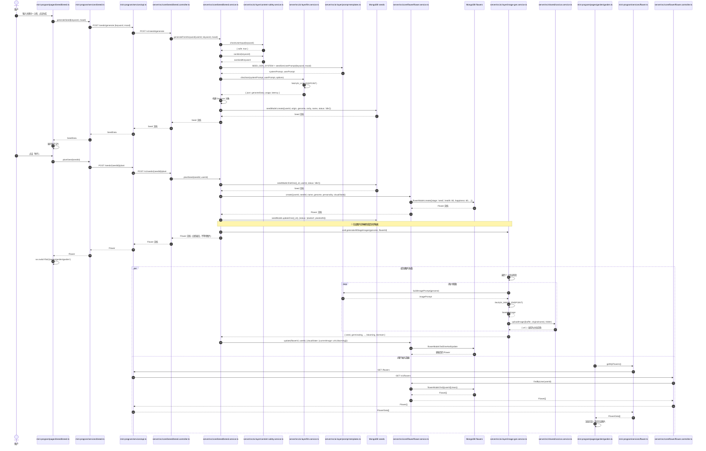

# 育种到种植完整调用链

> 从用户在育种页输入关键词，到种子生成、种植、花苗出现在花园，并触发花朵图片生成的完整链路。

---

## 1. 调用链步骤详解

### 步骤 1：前端育种页收集输入

**文件**：`mini-program/pages/breed/breed.ts`

- 用户在输入框输入关键词，选择心情标签。
- `generateSeed()` 被触发：
  - **入参**：`keyword: string`, `selectedMood: string`
  - 调用 `breedService.generateSeed(keyword, mood)`
  - **返回**：`SeedData` 对象，设置到 `data.generatedSeed`

### 步骤 2：前端 Service 发起生成请求

**文件**：`mini-program/services/breed.ts`

- `generateSeed(keyword, mood)`
  - **入参**：`keyword: string`, `mood?: string`
  - 调用 `api.post<SeedData>('/seeds/generate', { keyword, mood })`
  - **返回**：`SeedData`（`_id`, `name`, `rarity`, `previewImage`, `genome`, `origin`, `status` 等）

### 步骤 3：后端 BreedController 接收请求

**文件**：`server/src/core/breed/breed.controller.ts`

- `@Post('seeds/generate') generate(@CurrentUserId() userId, @Body() dto: GenerateSeedDto)`
  - **入参**：`userId: string`, `dto: { keyword, mood }`
  - 调用 `breedService.generateFromKeyword(userId, dto.keyword, dto.mood)`
  - **返回**：生成的 Seed 文档对象

### 步骤 4：后端 BreedService 生成种子

**文件**：`server/src/core/breed/breed.service.ts`

`generateFromKeyword(userId, keyword, mood)` 执行流程：

1. **内容安全检查**
   - 调用 `contentSafetyService.checkUserInput(keyword)`
   - 调用 `contentSafetyService.sanitize(keyword)`
   - **关键数据**：输入文本 / `{ safe: true }`

2. **LLM 生成花种 DNA**
   - 调用 `llmService.chatJson<Genome>(SEED_GEN_SYSTEM, seedGenUserPrompt(keyword, mood), options)`
   - **关键数据**：
     - **入参**：系统 Prompt（要求输出 JSON 格式花种定义）、用户 Prompt（关键词 + 心情）
     - **返回**：`genomeData`（包含 `species`, `displayName`, `colors`, `morphology`, `growth`, `rarity`, `tags`, `imagePrompt` 等）

3. **构建 Genome 对象**
   - 将 LLM 返回的数据映射为 `Genome` 类型。
   - 生成花名、稀有度。

4. **写入 MongoDB（seeds 集合）**
   - 调用 `seedModel.create({ userId, origin: { type: 'keyword', keyword }, genome, rarity, name, previewImage: '', status: 'idle', ... })`
   - **Schema 文件**：`server/src/core/breed/seed.schema.ts`

5. **返回种子**
   - 返回 `seed.toObject()` 给前端。

### 步骤 5：AI-Layer —— LLM 调用

**文件**：`server/src/ai-layer/llm.service.ts`

- `chatJson(systemPrompt, userMessage, options)` → 内部调用 `chat(..., jsonMode: true)`
- `chat(...)` 通过 `fetch()` 向 `AI_LLM_ENDPOINT`（默认 Anthropic Claude API）发送请求。
- **入参**：`model`, `max_tokens`, `temperature`, `system`, `messages`
- **返回**：`{ text, json, usage: { promptTokens, completionTokens }, latency }`

### 步骤 6：AI-Layer —— 内容安全

**文件**：`server/src/ai-layer/content-safety.service.ts`

- `checkUserInput(text)` 执行：
  - 关键词过滤（当前 `bannedWords` 为空列表，生产环境应接入腾讯云 NLP）
  - 默认返回 `{ safe: true }`
- `sanitize(text)` 移除手机号、身份证、邮箱等隐私信息。

### 步骤 7：用户点击「种植」

**文件**：`mini-program/pages/breed/breed.ts`

- `plantSeed(e)` 被触发：
  - 从 `e.currentTarget.dataset.seedId` 获取种子 ID。
  - 调用 `breedService.plantSeed(seedId)`
  - **入参**：`seedId: string`
  - 成功后显示 Toast，调用 `loadMySeeds()`，然后 `wx.switchTab` 跳转到花园页。

### 步骤 8：前端 Service 发起种植请求

**文件**：`mini-program/services/breed.ts`

- `plantSeed(seedId)`
  - 调用 `api.post(`/seeds/${seedId}/plant`)`
  - **返回**：种植后的 Flower 对象（后端实际返回）

### 步骤 9：后端 BreedController 接收种植请求

**文件**：`server/src/core/breed/breed.controller.ts`

- `@Post('seeds/:id/plant') plant(@Param('id') id, @CurrentUserId() userId, @Body() dto: PlantSeedDto)`
  - **入参**：`id: string`, `userId: string`
  - 调用 `breedService.plantSeed(id, userId)`

### 步骤 10：后端 BreedService 执行种植

**文件**：`server/src/core/breed/breed.service.ts`

`plantSeed(seedId, userId, flowerName?)` 执行流程：

1. **查询种子**
   - `seedModel.findOne({ _id: seedId, userId, status: 'idle' })`
   - 若不存在则抛出错误。

2. **创建花朵**
   - 调用 `flowerService.create({ userId, seedId, name, genome, personality, visualState })`
   - **传入关键数据**：种子基因 `genome`、默认 `visualState`（`currentImage: seed.previewImage` 为空字符串）
   - **返回**：`Flower` 文档，初始 `stage: 'seed'`, `health: 80`, `happiness: 60`

3. **更新种子状态**
   - `seedModel.updateOne({ _id: seedId }, { status: 'planted', plantedAt: new Date() })`

4. **异步触发花朵图片生成**（详见下文特别说明）

5. **返回花朵**
   - 立即返回 `flower` 给前端。

### 步骤 11：后端 FlowerService 创建花朵

**文件**：`server/src/core/flower/flower.service.ts`

- `create(data: Partial<Flower>)`
  - `new this.flowerModel({ ...data, stage: 'seed', health: 80, happiness: 60, stageTimestamps: { seed: new Date() } })`
  - **Schema 文件**：`server/src/core/flower/flower.schema.ts`
  - 返回 `flower.save().toObject()`

### 步骤 12：前端花园页加载花朵

**文件**：`mini-program/pages/garden/garden.ts`

- `onShow()` → `loadGarden()`
- `loadGarden()` 调用 `flowerService.getMyFlowers()`
- 返回花朵列表后调用 `gardenStore.setFlowers(flowers)`，页面渲染出花苗。

### 步骤 13：前端 FlowerService 获取花朵列表

**文件**：`mini-program/services/flower.ts`

- `getMyFlowers()` 调用 `api.get<FlowerData[]>('/flowers')`
- **返回**：`FlowerData[]` 数组，其中包含 `visualState.currentImage`

### 步骤 14：后端 FlowerController 返回花朵

**文件**：`server/src/core/flower/flower.controller.ts`

- `@Get() myFlowers(@CurrentUserId() userId)`
  - 调用 `flowerService.findByUser(userId)`
  - 返回当前用户的所有花朵。

### 步骤 15：后端 FlowerService 查询花朵

**文件**：`server/src/core/flower/flower.service.ts`

- `findByUser(userId)`
  - `this.flowerModel.find({ userId }).sort({ plantedAt: -1 }).lean()`
  - 从 MongoDB `flowers` 集合查询。

---

## 2. 花朵图片生成特别说明

花朵图片**不是在生成种子时生成的**，而是在**种植完成后异步触发**的。

### 触发位置

**文件**：`server/src/core/breed/breed.service.ts` → `plantSeed()` 方法

```typescript
// 异步触发图像生成 (不阻塞种植)
void this.imageGenService.generateAllStageImages(seed.genome, flower._id)
  .then((urls) => {
    this.flowerService.update(flower._id as string, userId, {
      visualState: { currentImage: urls.blooming, scale: 1, rotation: 0, colorAdjust: { hue: 0, saturation: 1, brightness: 1 } },
    } as never);
  })
  .catch((err) => this.logger.error(`[Breed] Image gen failed for flower ${flower._id}: ${err.message}`));
```

### 为什么是异步？

- `plantSeed()` 接口**立即返回**创建好的 `Flower` 文档，不会等待图片生成完成。
- 图片生成耗时长（调用外部 AI 图像 API + 上传 COS），同步等待会严重拖慢种植接口响应。
- 使用 `void ... .then()` 语法显式表示**不 await**，让图片生成在后台运行。

### 图片生成链路

1. `ImageGenService.generateAllStageImages(seedGenome, flowerId)`
   - 遍历 7 个阶段：`['seed', 'germinating', 'growing', 'budding', 'blooming', 'fruiting', 'dormant']`
   - 对每个阶段调用 `generateFlowerImage(seedGenome, flowerId, stage)`

2. `ImageGenService.generateFlowerImage(seedGenome, flowerId, stage)`
   - 调用 `buildImagePrompt(seedGenome)` 构造英文图像 Prompt
   - 调用 `fetch(AI_IMAGE_ENDPOINT)` 请求 Stability AI API
   - 将返回的 base64 图片通过 `cosService.uploadImage()` 上传到腾讯云 COS
   - 返回 `{ imageUrl, seed, width, height, latency }`

3. `CosService.uploadImage(file, folder)`
   - **当前是 TODO 占位实现**：未调用真实 COS SDK，仅拼接 URL 返回。
   - 因此即使 AI 图像 API 调用成功，图片也未必真正可访问。

### 图片何时显示在花园？

- 种植完成瞬间：花园显示的花朵是 `FlowerRenderer` 绘制的占位图形（`currentImage` 为空字符串）。
- 图片生成完成后：`currentImage` 被更新为 `urls.blooming`。
- 用户下次进入花园或下拉刷新时，从 `/flowers` 接口拿到更新后的 `currentImage`，即可显示真实图片。

---

## 3. 完整调用链时序图



---

## 4. 关键数据流转总结

| 阶段 | 关键输入 | 关键输出 | 落库/副作用 |
|------|----------|----------|-------------|
| 生成种子 | keyword, mood, userId | `SeedData`（含 `genome`） | 写入 `seeds` 集合 |
| LLM DNA 生成 | 系统 Prompt + 用户关键词 | `genomeData` JSON | 调用外部 Claude API |
| 安全检查 | 用户输入文本 | `{ safe: true }` | 当前为占位实现 |
| 种植种子 | seedId, userId | `Flower`（stage='seed'） | 写入 `flowers` 集合，更新 `seeds.status='planted'` |
| 异步图片生成 | `genome`, `flowerId` | 7 个阶段的图片 URL | 更新 `flowers.visualState.currentImage` |
| 花园加载 | userId | `FlowerData[]` | 从 `flowers` 集合读取 |

---

## 5. 注意事项

- **图片生成是异步的**：种植接口不等待图片完成，前端初始看到的是占位渲染。
- **COS 上传是占位实现**：`cos.service.ts` 未真正调用腾讯云 COS SDK，返回的是拼接 URL。
- **内容安全当前为空**：`bannedWords` 为空数组，实际生产需要接入腾讯云 NLP 或补充敏感词库。
- **LLM 调用失败会降级**：若 `AI_LLM_API_KEY` 未配置，`llm.service.ts` 会抛出错误，`breed.service.ts` 中目前未显式 catch，可能导致生成失败。
