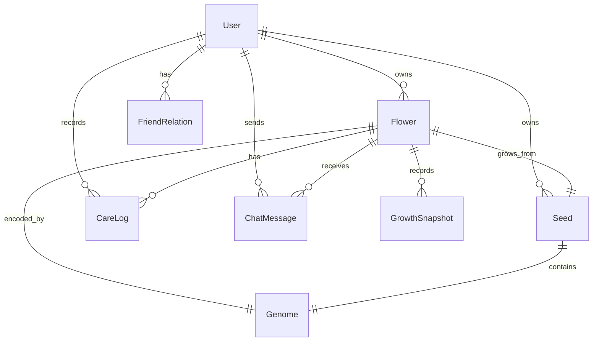

# 🏗️ 赛博养花 — 技术架构设计

> 版本: v1.0 | 日期: 2026-06-13

---

## 目录

1. [架构概览](#1-架构概览)
2. [前端架构](#2-前端架构)
3. [后端架构](#3-后端架构)
4. [AI服务层](#4-ai服务层)
5. [数据模型](#5-数据模型)
6. [API设计](#6-api设计)
7. [安全与性能](#7-安全与性能)
8. [部署架构](#8-部署架构)

---

## 1. 架构概览

### 1.1 系统全景

```
┌──────────────────────────────────────────────────────────────────┐
│                        微信小程序客户端                            │
│  ┌─────────┐ ┌──────────┐ ┌──────────┐ ┌─────────┐ ┌─────────┐  │
│  │ 花园视图 │ │ 育种系统  │ │ AI对话   │ │  图鉴   │ │  社交   │  │
│  └────┬────┘ └────┬─────┘ └────┬─────┘ └────┬────┘ └────┬────┘  │
│       └───────────┴────────────┴────────────┴───────────┘        │
│                              │ HTTPS                              │
└──────────────────────────────┼───────────────────────────────────┘
                               │
               ┌───────────────┴───────────────┐
               │          API Gateway           │
               │     (微信云开发 / 自建)         │
               └───────────────┬───────────────┘
                               │
       ┌───────────────────────┼───────────────────────┐
       │                       │                       │
┌──────┴──────┐     ┌─────────┴─────────┐    ┌────────┴────────┐
│  业务服务层  │     │    AI 服务层       │    │   资源服务层     │
│              │     │                   │    │                 │
│ • 用户服务   │     │ • 种子生成引擎     │    │ • 图片存储/CDN  │
│ • 养成引擎   │     │ • 生长AI引擎      │    │ • 静态资源      │
│ • 社交服务   │     │ • 对话AI引擎      │    │ • 日志/监控     │
│ • 节气系统   │     │ • 图像生成引擎     │    │                 │
└──────┬──────┘     └─────────┬─────────┘    └────────┬────────┘
       │                       │                       │
       └───────────────────────┼───────────────────────┘
                               │
               ┌───────────────┴───────────────┐
               │         数据存储层              │
               │  ┌────────┐  ┌──────────────┐  │
               │  │ MongoDB │  │  Cloud Storage│  │
               │  └────────┘  └──────────────┘  │
               │  ┌────────┐  ┌──────────────┐  │
               │  │  Redis  │  │ Elasticsearch │  │
               │  └────────┘  └──────────────┘  │
               └───────────────────────────────┘
```

### 1.2 技术选型

| 层级 | 技术 | 选型理由 |
|------|------|----------|
| **小程序框架** | 微信原生 + TypeScript | 最佳性能、完整API、类型安全 |
| **状态管理** | MobX + miniprogram-computed | 轻量响应式、适合复杂状态 |
| **后端框架** | Node.js + NestJS | 企业级架构、依赖注入、模块化 |
| **云服务** | 微信云开发 (基础) + 腾讯云 (扩展) | 快速启动、平滑迁移 |
| **数据库** | 云开发数据库 (MongoDB) | 文档型、灵活Schema、地理查询 |
| **缓存** | Redis | 会话管理、热点数据、AI结果缓存 |
| **消息队列** | RabbitMQ / 腾讯云CMQ | AI任务异步处理、削峰填谷 |
| **AI-图像** | Stable Diffusion API (自建/Replicate) | 可控性强、成本可控 |
| **AI-对话** | Claude API / 通义千问 | 中文能力强、安全合规 |
| **对象存储** | 腾讯云COS | 图片存储、CDN加速 |
| **监控** | 腾讯云监控 + Sentry | 错误追踪、性能监控 |

---

## 2. 前端架构

### 2.1 项目结构

```
mini-program/
├── app.ts                          # 应用入口
├── app.json                        # 应用配置
├── app.wxss                        # 全局样式
├── theme/                          # 主题系统
│   ├── colors.ts                   # 色彩变量
│   ├── typography.ts               # 字体系统
│   └── spacing.ts                  # 间距系统
├── components/                     # 通用组件
│   ├── flower-viewer/              # 花朵渲染组件
│   ├── care-panel/                 # 照料操作面板
│   ├── chat-bubble/                # 对话气泡
│   ├── seed-card/                  # 种子卡片
│   ├── garden-scene/               # 花园场景
│   ├── season-effect/              # 节气特效
│   └── ui/                         # 基础UI组件
├── pages/                          # 页面
│   ├── garden/                     # 花园主页
│   ├── breed/                      # 育种页
│   ├── chat/                       # 对话页
│   ├── collection/                 # 图鉴页
│   ├── social/                     # 社交页
│   └── profile/                    # 个人中心
├── services/                       # 业务服务
│   ├── api.ts                      # API请求封装
│   ├── auth.ts                     # 认证服务
│   ├── flower.ts                   # 花朵数据服务
│   ├── breed.ts                    # 育种服务
│   └── social.ts                   # 社交服务
├── stores/                         # 状态管理
│   ├── userStore.ts                # 用户状态
│   ├── gardenStore.ts              # 花园状态
│   └── breedStore.ts               # 育种状态
├── utils/                          # 工具函数
│   ├── plant-utils.ts              # 植物计算工具
│   ├── season-utils.ts             # 节气计算工具
│   └── image-loader.ts             # 图片加载优化
└── workers/                        # 异步任务
    └── image-preloader.ts          # 图片预加载
```

### 2.2 花朵渲染方案

由于微信小程序对WebGL支持有限，采用**分层精灵动画**方案实现真实感花朵：

```
花朵渲染层级 (从底到顶):
┌──────────────────┐
│  Layer 5: 花瓣层  │  ← 主体花瓣 (AI生成的高清PNG，带动画变换)
├──────────────────┤
│  Layer 4: 花蕊层  │  ← 中心花蕊纹理
├──────────────────┤
│  Layer 3: 花萼层  │  ← 花萼/花托
├──────────────────┤
│  Layer 2: 茎叶层  │  ← 茎秆+叶片 (骨骼动画)
├──────────────────┤
│  Layer 1: 花盆层  │  ← 花盆/土壤 (用户可选)
├──────────────────┤
│  Layer 0: 阴影层  │  ← 动态投影
└──────────────────┘
```

**渲染方式**:
- 花瓣主体: AI预生成多阶段PNG（种子/发芽/生长期/花苞/盛花/结果），客户端Canvas合成过渡
- 呼吸动画: CSS transform + requestAnimationFrame 模拟花瓣微动
- 生长动画: 分层透明度过渡 + 缩放 + 骨骼路径动画
- 光照效果: CSS filter + Canvas全局合成模式

### 2.3 关键页面性能策略

| 页面 | 策略 | 目标 |
|------|------|------|
| 花园主页 | 图片预加载 + 懒加载 + Canvas离屏渲染 | 首帧 < 1s |
| 育种页 | AI生成loading动画 + 本地种子缓存 | 生成体感 < 3s |
| 对话页 | WebSocket + 打字机效果流式输出 | 首字 < 1s |
| 图鉴页 | 虚拟列表 + 缩略图CDN | 滑动 60fps |
| 社交页 | 分页加载 + 骨架屏 | 数据加载体感 < 1s |

---

## 3. 后端架构

### 3.1 服务划分

```
server/
├── api-gateway/                    # API网关
│   ├── src/
│   │   ├── main.ts                 # 入口
│   │   ├── filters/                # 异常过滤器
│   │   ├── interceptors/           # 拦截器
│   │   └── guards/                 # 鉴权守卫
├── services/
│   ├── user-service/               # 用户服务
│   │   ├── src/
│   │   │   ├── user.controller.ts
│   │   │   ├── user.service.ts
│   │   │   └── dto/
│   ├── flower-service/             # 花朵服务 (核心)
│   │   ├── src/
│   │   │   ├── flower.controller.ts
│   │   │   ├── flower.service.ts   # 花朵CRUD
│   │   │   ├── growth.engine.ts    # 生长引擎
│   │   │   ├── genome.generator.ts # 基因生成器
│   │   │   └── season.service.ts   # 节气服务
│   ├── breed-service/              # 育种服务
│   │   ├── src/
│   │   │   ├── breed.controller.ts
│   │   │   └── seed.generator.ts   # 种子生成协调
│   ├── chat-service/               # 对话服务
│   │   ├── src/
│   │   │   ├── chat.controller.ts
│   │   │   ├── chat.service.ts
│   │   │   ├── personality.engine.ts # 人格引擎
│   │   │   └── memory.service.ts   # 对话记忆
│   └── social-service/             # 社交服务
│       ├── src/
│       │   ├── social.controller.ts
│       │   ├── garden-visit.service.ts
│       │   └── gift.service.ts
├── ai-layer/                       # AI服务层 (见第4节)
├── shared/                         # 共享模块
│   ├── database/                   # 数据库连接
│   ├── redis/                      # Redis工具
│   ├── cos/                        # 对象存储工具
│   └── types/                      # 类型定义
└── infrastructure/                 # 基础设施
    ├── docker/                     # Docker配置
    ├── k8s/                        # K8s配置
    └── terraform/                  # IaC
```

### 3.2 核心引擎设计

#### 生长引擎 (Growth Engine)

```typescript
// 生长引擎核心逻辑
interface GrowthInput {
  flowerDNA: Genome;
  careHistory: CareAction[];
  currentStage: GrowthStage;
  daysSincePlanting: number;
  seasonContext: SeasonContext;
}

interface GrowthOutput {
  newStage: GrowthStage;
  visualChanges: VisualDelta[];
  healthScore: number;        // 0-100
  bloomQuality: number;       // 0-100
  nextMilestone: Milestone;
}

class GrowthEngine {
  // AI驱动的生长计算
  async calculate(input: GrowthInput): Promise<GrowthOutput> {
    // 1. 基础规则引擎：根据照料分数计算基础生长进度
    const baseProgress = this.calculateBaseProgress(input);
    
    // 2. AI修正：调用AI模型微调生长方向
    const aiAdjustment = await this.aiGrowthModel.predict({
      dna: input.flowerDNA,
      care: input.careHistory,
      season: input.seasonContext
    });
    
    // 3. 合并输出
    return this.merge(baseProgress, aiAdjustment);
  }
}
```

#### 人格引擎 (Personality Engine)

```typescript
// 花朵AI人格管理
class PersonalityEngine {
  // 根据DNA生成基础人格
  generateBasePersonality(genome: Genome): Personality;
  
  // 根据用户互动历史演化人格
  evolve(personality: Personality, interactions: Interaction[]): Personality;
  
  // 生成当前情绪状态
  currentMood(personality: Personality, context: Context): Mood;
  
  // 生成对话风格参数
  generateSpeakingParams(personality: Personality): SpeakingParams;
}
```

---

## 4. AI服务层

### 4.1 AI服务矩阵

```
┌─────────────────────────────────────────────────────┐
│                   AI 服务编排层                        │
│                                                       │
│  ┌─────────────┐  ┌─────────────┐  ┌─────────────┐   │
│  │ 种子生成器   │  │ 生长预测器   │  │ 对话生成器   │   │
│  │ SeedGen AI  │  │ Growth AI   │  │  Chat AI    │   │
│  └──────┬──────┘  └──────┬──────┘  └──────┬──────┘   │
│         │                │                │           │
│  ┌──────┴──────┐  ┌──────┴──────┐  ┌──────┴──────┐   │
│  │ 图像生成模型 │  │ 预测模型    │  │  大语言模型  │   │
│  │ (SD/FLUX)   │  │ (自定义)    │  │ (Claude/GPT) │   │
│  └─────────────┘  └─────────────┘  └─────────────┘   │
│                                                       │
│  ┌─────────────────────────────────────────────────┐  │
│  │              内容安全网关 (Content Safety)        │  │
│  │   输入过滤 → 生成内容审核 → 敏感词拦截 → 合规检查  │  │
│  └─────────────────────────────────────────────────┘  │
└─────────────────────────────────────────────────────┘
```

### 4.2 种子生成流程

```
用户输入关键词
     │
     ▼
┌──────────────┐
│ 语义解析      │  ← NLP提取: 情绪、意象、色彩、形态关键词
│ (LLM调用)     │
└──────┬───────┘
       │
       ▼
┌──────────────┐
│ DNA生成       │  ← LLM生成genome结构: 品种、花色、形态参数
│ (LLM调用)     │
└──────┬───────┘
       │
       ▼
┌──────────────┐
│ Prompt构建    │  ← DNA参数 → 图像生成Prompt
│ (规则引擎)    │
└──────┬───────┘
       │
       ▼
┌──────────────┐
│ 图像生成      │  ← Stable Diffusion / FLUX 生成花朵图片
│ (SD API)      │     输出: 多阶段图片包 (阶段×角度)
└──────┬───────┘
       │
       ▼
┌──────────────┐
│ 后处理        │  ← 背景移除、尺寸统一、压缩优化、CDN上传
│ (ImageProc)   │
└──────┬───────┘
       │
       ▼
   返回种子数据包
```

### 4.3 AI成本估算

| AI调用 | 模型选择 | 单次成本 | 日预估量(千DAU) | 日成本 |
|--------|----------|----------|-----------------|--------|
| 种子DNA生成 | Claude Haiku / GPT-4o-mini | ¥0.01 | 3,000 | ¥30 |
| 花朵图像生成 | SD 1.5 / FLUX Schnell | ¥0.15 | 3,000 | ¥450 |
| 每日生长AI | 自建轻量模型 | ¥0.001 | 10,000 | ¥10 |
| AI对话 | Claude Haiku / GPT-4o-mini | ¥0.005 | 50,000轮 | ¥250 |
| 内容安全 | 腾讯云NLP | ¥0.001 | 所有请求 | ¥50 |

> **日成本估算 (千DAU)**: ~¥800/天 | **月成本**: ~¥24,000

---

## 5. 数据模型

### 5.1 核心实体关系



### 5.2 关键Schema

#### User (用户)

```typescript
interface User {
  _id: string;                    // 微信OpenID
  nickname: string;
  avatar: string;
  createdAt: Date;
  stats: {
    totalFlowers: number;        // 累计养花数
    currentFlowers: number;      // 当前存活数
    collectionCount: number;     // 图鉴收集数
    gardenLevel: number;         // 花园等级
    careStreak: number;          // 连续照料天数
  };
  resources: {
    water: number;               // 水资源
    fertilizer: number;          // 肥料
    seedSlots: number;           // 种子槽位
    rareSeedCoupon: number;      // 稀有种子券
  };
  preferences: {
    seasonNotifications: boolean;
    dailyReminder: boolean;
    darkMode: boolean;
  };
}
```

#### Flower (花朵)

```typescript
interface Flower {
  _id: string;
  userId: string;
  seedId: string;
  name: string;                   // 用户或AI命名
  genome: Genome;                 // DNA数据
  stage: GrowthStage;             // 当前生长阶段
  health: number;                 // 健康度 0-100
  happiness: number;              // 幸福度 0-100
  plantedAt: Date;
  stageTimestamps: Record<GrowthStage, Date>;
  position: { x: number; y: number }; // 花园中位置
  potStyle: PotStyle;
  personality: Personality;
  visualState: {                   // 当前视觉参数
    currentImage: string;          // 当前阶段图片URL
    scale: number;
    rotation: number;
    colorAdjust: { hue: number; saturation: number; brightness: number };
  };
  memo: string;                    // 用户备注
  isFavorite: boolean;
}

type GrowthStage = 'seed' | 'germinating' | 'growing' | 'budding' | 'blooming' | 'fruiting' | 'dormant';
```

#### Seed (种子)

```typescript
interface Seed {
  _id: string;
  userId: string;
  origin: {
    type: 'keyword' | 'daily' | 'gift' | 'hybrid' | 'event';
    keyword?: string;            // 关键词生成时的输入
    gifterId?: string;           // 赠送者ID
    eventId?: string;            // 活动ID
    parentSeeds?: [string, string]; // 杂交亲本
  };
  genome: Genome;
  rarity: 'common' | 'uncommon' | 'rare' | 'epic' | 'legendary';
  previewImage: string;          // 种子预览图
  name: string;
  generatedAt: Date;
  plantedAt?: Date;              // 被种植时间
  status: 'idle' | 'planted' | 'expired' | 'gifted';
}
```

#### Genome (基因)

```typescript
interface Genome {
  species: string;               // 物种ID
  displayName: string;           // 品种中文名
  parentLineage: string[];       // 谱系
  colors: {
    petalPrimary: RGB;
    petalSecondary: RGB;
    petalAccent: RGB;
    center: RGB;
    leaf: RGB;
    stem: RGB;
  };
  morphology: {
    petalShape: string;          // 花瓣形状类型
    petalCount: number;          // 花瓣数量
    petalLayers: number;         // 花瓣层数
    bloomSize: number;           // 花朵大小 0-1
    stemHeight: number;          // 茎高度 0-1
    leafDensity: number;         // 叶片密度 0-1
    leafShape: string;           // 叶片形状类型
  };
  growth: {
    germinationDays: number;     // 发芽天数
    bloomDays: number;           // 开花天数
    fullLifeDays: number;        // 完整生命周期
    seasonPreference: Season;    // 适宜季节
    waterNeed: number;           // 水分需求 0-1
    lightNeed: number;           // 光照需求 0-1
    toughness: number;           // 抗逆性 0-1
  };
  rarity: string;
  tags: string[];                // 特性标签
}
```

#### CareLog (照料记录)

```typescript
interface CareLog {
  _id: string;
  flowerId: string;
  userId: string;
  action: 'water' | 'fertilize' | 'prune' | 'adjust_light' | 'talk';
  value: number;
  timestamp: Date;
  effect: {
    healthDelta: number;
    happinessDelta: number;
    growthDelta: number;
  };
}
```

---

## 6. API设计

### 6.1 RESTful API概览

```
Base URL: https://api.cyberbloom.cn/v1

认证方式: Bearer Token (JWT, 通过微信登录获取)

核心端点:

POST   /auth/login                    # 微信登录
GET    /auth/refresh                  # 刷新Token

GET    /garden                        # 获取花园数据
GET    /garden/season                 # 获取当前节气信息

POST   /flowers                       # 种植花朵
GET    /flowers/:id                   # 获取花朵详情
PATCH  /flowers/:id                   # 更新花朵状态
DELETE /flowers/:id                   # 移除花朵
POST   /flowers/:id/care              # 照料操作
GET    /flowers/:id/timeline          # 生长时间线
GET    /flowers/:id/snapshots         # 生长快照

POST   /seeds/generate                # AI关键词生成种子
GET    /seeds/daily                   # 领取每日种子
GET    /seeds                         # 我的种子列表
POST   /seeds/:id/plant               # 种植种子
POST   /seeds/:id/gift                # 赠送种子

POST   /chat/:flowerId/send           # 发送对话
GET    /chat/:flowerId/history        # 对话历史
DELETE /chat/:flowerId/history        # 清除对话历史

GET    /collection                    # 图鉴列表
GET    /collection/:speciesId         # 品种详情

GET    /social/friends                # 好友列表
GET    /social/garden/:userId         # 访问好友花园
POST   /social/garden/:userId/like    # 点赞花园
POST   /social/garden/:userId/comment # 留言
```

### 6.2 核心接口示例

#### POST /seeds/generate — AI生成种子

```typescript
// Request
{
  "keyword": "雨后彩虹",
  "mood": "hopeful"  // 可选
}

// Response
{
  "seed": {
    "id": "seed_abc123",
    "name": "虹雨",
    "rarity": "rare",
    "genome": { /* Genome对象 */ },
    "previewImage": "https://cdn.cyberbloom.cn/previews/abc123.png",
    "generatedAt": "2026-06-13T08:00:00Z"
  },
  "generationTime": 12.5,  // 秒
  "remainingDailyQuota": 0
}
```

#### POST /flowers/:id/care — 照料操作

```typescript
// Request
{
  "action": "water",
  "value": 15
}

// Response
{
  "flower": {
    "id": "flower_xyz",
    "health": 85,
    "happiness": 72,
    "stage": "growing",
    "visualState": { /* 更新后的视觉参数 */ }
  },
  "effect": {
    "healthDelta": 10,
    "happinessDelta": 5,
    "growthDelta": 3
  },
  "animation": {
    "type": "water_drop",
    "position": { "x": 0.5, "y": 0.2 },
    "particleCount": 12
  }
}
```

#### POST /chat/:flowerId/send — 对话

```typescript
// Request
{
  "message": "今天心情不太好..."
}

// Response (SSE流式 or 轮询)
{
  "flowerMessage": {
    "text": "怎么啦？虽然我不能给你一个真实的拥抱，但我的花瓣今天开得特别好，希望你能感受到一点暖意 🌸",
    "emotion": "caring",
    "visualReaction": {
      "type": "gentle_sway",
      "duration": 3000
    }
  },
  "flowerMood": {
    "current": "concerned",
    "intensity": 0.7
  }
}
```

---

## 7. 安全与性能

### 7.1 安全措施

| 层面 | 措施 | 实现 |
|------|------|------|
| **传输** | HTTPS强制 + 证书绑定 | Nginx/Traefik配置 |
| **认证** | 微信登录 + JWT双Token | access_token(2h) + refresh_token(30d) |
| **授权** | 资源级权限校验 | userId匹配 + 好友白名单 |
| **输入** | 参数校验 + SQL注入防护 | class-validator + Mongoose sanitize |
| **AI安全** | 内容过滤 + 生成审核 | 腾讯云NLP + 敏感词库 + 图片审核 |
| **限流** | 接口级 + 用户级限流 | NestJS Throttler + Redis |
| **数据** | 敏感字段加密 + 定期备份 | AES-256 + MongoDB Atlas Backup |

### 7.2 性能策略

```
请求链路优化:

客户端                     服务端                         AI服务
  │                         │                              │
  │──① 发送请求────────────→│                              │
  │                         │──② 检查Redis缓存             │
  │                         │←─③ 命中缓存，直接返回        │
  │←④ 返回数据─────────────│                              │
  │                         │                              │
  │   (缓存未命中时)         │                              │
  │                         │──⑤ 异步发送AI请求──────────→│
  │                         │     返回loading状态           │
  │←⑥ loading + 任务ID────│                              │
  │                         │                              │
  │──⑦ 轮询任务状态────────→│                              │
  │←⑧ 结果/进度───────────│←─⑨ AI返回结果───────────────│
```

**关键优化**:
- AI种子生成结果缓存 (相同关键词7天内返回缓存)
- 图片CDN加速 + WebP格式 + 渐进式加载
- 花园主页预加载相邻花朵图片
- 对话使用SSE流式传输
- 数据库合理索引 + 查询投影

---

## 8. 部署架构

### 8.1 环境规划

| 环境 | 用途 | 配置 |
|------|------|------|
| **dev** | 本地开发 | Docker Compose |
| **test** | 自动化测试 | 腾讯云轻量服务器 |
| **staging** | 预发布验证 | 与生产同配置缩水版 |
| **prod** | 生产环境 | 腾讯云K8s集群 |

### 8.2 生产部署

```
                      ┌──────────────┐
                      │   用户流量    │
                      └──────┬───────┘
                             │
                      ┌──────┴───────┐
                      │   CDN (COS)  │  静态资源/图片
                      └──────────────┘
                             │
                      ┌──────┴───────┐
                      │   CLB 负载均衡 │
                      └──────┬───────┘
                             │
                ┌────────────┼────────────┐
                │            │            │
          ┌─────┴─────┐ ┌───┴───┐ ┌─────┴─────┐
          │ API Pod   │ │ API   │ │ API Pod   │  (K8s HPA自动扩缩)
          │ (NestJS)  │ │ Pod   │ │ (NestJS)  │
          └─────┬─────┘ └───┬───┘ └─────┬─────┘
                │            │            │
                └────────────┼────────────┘
                             │
          ┌──────────────────┼──────────────────┐
          │                  │                  │
    ┌─────┴─────┐    ┌──────┴──────┐   ┌──────┴──────┐
    │ MongoDB   │    │   Redis     │   │ 消息队列    │
    │ (副本集)  │    │ (主从+哨兵) │   │ (RabbitMQ)  │
    └───────────┘    └─────────────┘   └──────┬──────┘
                                              │
                                       ┌──────┴──────┐
                                       │  AI Worker  │
                                       │ (异步处理)   │
                                       └─────────────┘
```

---

### 8.3 里程碑与成本

| 阶段 | 内容 | 时间 | 月成本 |
|------|------|------|--------|
| **M0: 原型** | 核心闭环Demo，微信云开发 | 4周 | ¥500 |
| **M1: MVP** | P0功能完整，自建后端 | 8周 | ¥5,000 |
| **M2: 增长** | P1功能，性能优化 | 12周 | ¥25,000 |
| **M3: 规模化** | P2功能，K8s集群，完整监控 | 16周 | ¥80,000+ |

---

> 下一步: [UI/UX设计系统](./ui-design.md)
